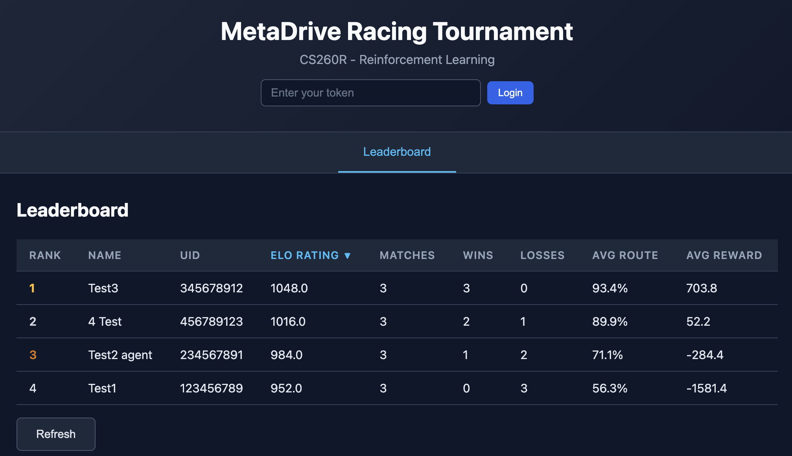

<p align="center">
  
</p>

# MetaDrive Racing Tournament

*Mini Project of CS260R: Reinforcement Learning. Department of Computer Science at University of California, Los Angeles.*

---

## **Overview**

The goal of this assignment is to apply your knowledge of reinforcement learning (RL) to train a competitive RL agent
that performs well in the **MetaDrive Multi-agent Racing Environment**. After training your agent, you will first verify its performance by racing against the provided baseline agent. Then, submit your agent to our evaluation server to compete with each other. After the project is due, we will have a tournament for all the submitted agents.

You are free to choose **any RL algorithm or codebase** to train your agent.

<p align="center">
  
</p>

## Changelog

- **`[Feb. 17, 2026]`** The evaluation server is up at [http://bolei-gpu03.cs.ucla.edu:8000/](http://bolei-gpu03.cs.ucla.edu:8000/). Submit your agents now!

## **Steps to Complete the Project**

1. Understand the environment. **Select an RL algorithm** to train your agent.
2. **Implement and train your agent** in the racing environment.
3. **Verify the performance** by local evaluation against the baseline agent.
4. **Submit to the evaluation server** to compete with your classmates.
5. **Compose and submit** your trained agent and project report.

## **1.1 Get Your Agent**

- Train your agent using any RL algorithm. You can use `train.py` as a starting point.
- Your trained agent must be self-contained---**do not import files outside your subfolder** or **import any external package**
  (PyTorch and NumPy are fine. We will stick to torch=2.6.0). You can refer to `agents/example_agent` for an example.
- Name your agent subfolder with `agent_YOUR-UID` (e.g., `agents/agent_000000000/`).
- Ensure that your agent is properly implemented in the `Policy` class and can run with `eval_local.py` without bugs. Please make sure your agent can be evaluated by running
  `python eval_local.py --agent-dirs agents/agent_YOUR-UID agents/example_agent --mode versus`
- To ensure compatibility, you can create a new conda environment with only torch and some basic packages installed.
  Then run `eval_local.py` in this environment to check if your agent can be evaluated.

## **1.2 Environment Overview**

* The agent needs to steer the target vehicle with low-level controls (steering and throttle) to race against opponents
  on tracks. Specifically, in the MetaDrive multi-agent racing environment, the agent competes against opponent vehicles
  on a shared track with straights and curves.
* In `env.py`, a single-agent wrapper (`RacingEnv`) is provided that wraps the multi-agent racing environment into a
  standard Gymnasium interface, letting you train with standard RL libraries like Stable Baselines3.
* In `racing_maps.py`, we provide two predefined racing maps for training and evaluation. Feel free to customize more maps for better generalization ability.
* Remember that we only require you to submit one agent and there is no requirement on which environment configuration
  or which algorithm you use to acquire the agent.

## **2 Training Example**

```bash
python train.py --total-timesteps 2000000
```

This will:

1. Train a PPO agent against aggressive opponents
2. Save checkpoints to `checkpoints/`
3. Log metrics to `logs/` (view with `tensorboard --logdir logs`)
4. Auto-convert the final model to submission format in `agents/agent_YOUR-UID/`

## **3 Local Evaluation with Baseline**

Evaluate your trained agent in the local environment to ensure your agent can run smoothly. We will release the baseline agent as a performance reference for grading.

```bash
# Single agent vs built-in opponents, sanity check
python eval_local.py --agent-dirs agents/agent_YOUR-UID

# Versus mode: race your agent with baseline
python eval_local.py --agent-dirs agents/agent_YOUR-UID agents/agent_baseline --mode versus

# Evaluate on a specific map
python eval_local.py --agent-dirs agents/agent_YOUR-UID agents/agent_baseline --map hairpin

# Visualize with BEV & front camera rendering
python eval_local.py --agent-dirs agents/agent_YOUR-UID agents/agent_baseline --render
```

## **4 Online Evaluation and Competition**

Follow the tutorial video to submit your agent and race with others at http://bolei-gpu03.cs.ucla.edu:8000/.

<video src="https://github.com/user-attachments/assets/34b1d61b-c27a-4ba9-8b2d-55c2693fa4a5" width="1162" height="926" controls></video>

## **5 What You Need to Submit**

Your submission must contain:

1. **Your trained RL agent** (The agent zip file)
   - Place your agent in a subfolder under `agents/`.
   - Zip this subfolder, so that after unzip we get a FOLDER instead of files.
   - Upload it to BruinLearn assignment submission box with name "agent zip file".
2. **A PDF Report**

   - Include your **name and UID**.
   - Describe your **efforts and innovations** in training your agent.
   - **Submit this PDF inside your agent folder AND upload it to Gradescope.**
3. **Your training code and logs (if any)** (The code zip file)

   - Zip the whole project folder, include all your code and logs and upload it to BruinLearn.

## Grading

The project is graded based on the following perspectives. Performance is defined as the win rate in terms of arrival time.

1. Trained agent achieves the same or better performance as the baseline agent (40 pts)

   * in your local environment with predefined maps (20 pts)
   * on the evaluation server with hidden maps (20 pts)
2. Performance of the trained agent in the tournament (40 pts)
   * Beat the easy/medium/hard agent (with win rate `b1 b2 b3`) uploaded by the TA to get 10/20/30 pts.
   * For win rate $r$, and $r_{\max}$ is the max win rate on the leaderboard:

$$
\text{performance score}(r) = \begin{cases} 
10 \cdot \dfrac{r}{b_{1}} & 0 < r \leq b_{1} \\
10 + 10 \cdot \dfrac{r - b_{1}}{b_{2} - b_{1}} & b_{1} < r \leq b_{2} \\
20 + 10 \cdot \dfrac{r - b_{2}}{b_{3} - b_{2}} & b_{2} < r \leq b_{3} \\
30 + 10 \cdot \dfrac{r - b_{3}}{r_{\max} - b_{3}} & b_{3} < r \leq r_{\max}
\end{cases}
$$

3. Report (20 pts)
	* A well-documented analysis of different training strategies, hyperparameters, or architectural choices and their
		impact on performance.
	* You don't need to get the best agent in order to earn this. We want to see your insights and lessons learned from
		experimenting with different setups.
4. Bonus (up to 20 pts)
	* Top 5/10/20 agents get an additional 20/10/5 bonus pts.

## Local Verification

You can run the following command to verify your agent locally:

```bash
# Install the required packages
conda env create -f environment.yml

conda activate cs260r_miniproject

python eval_local.py --agent-dirs agents/agent_YOUR-UID agents/example_agent --mode versus
```
